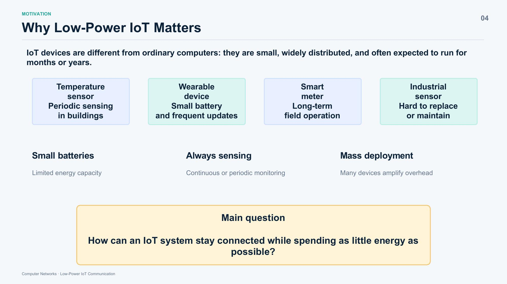
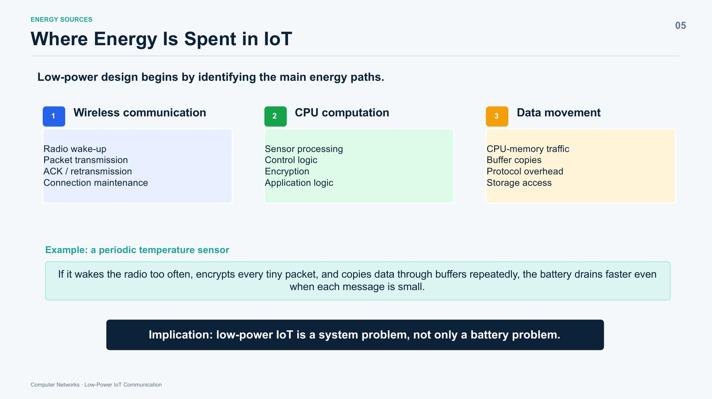
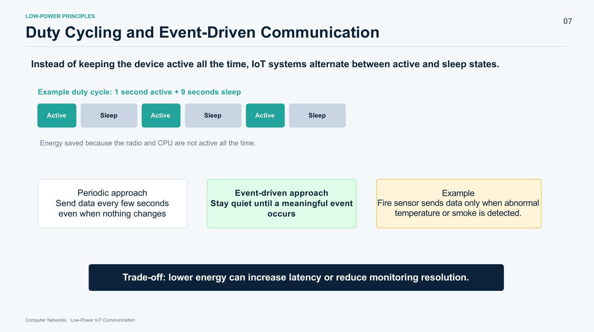
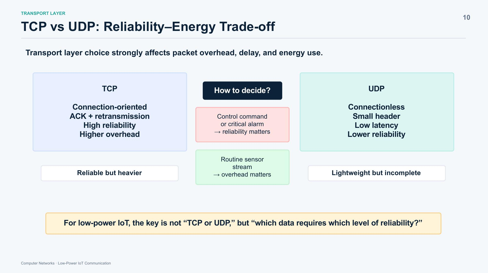
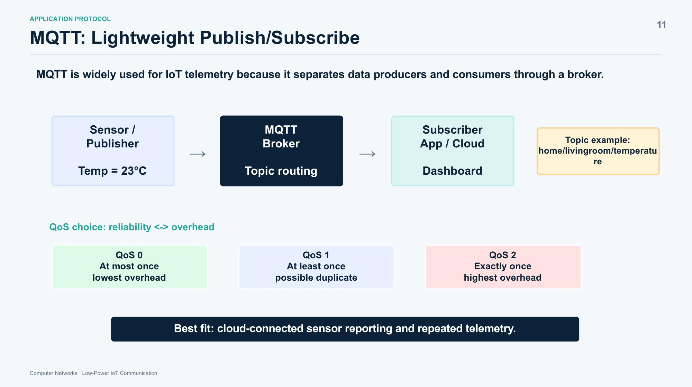
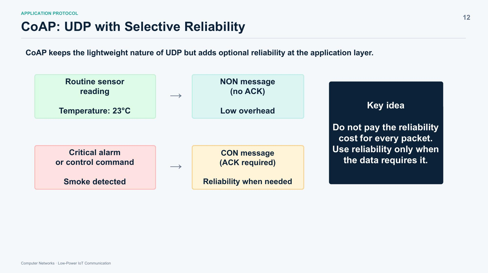
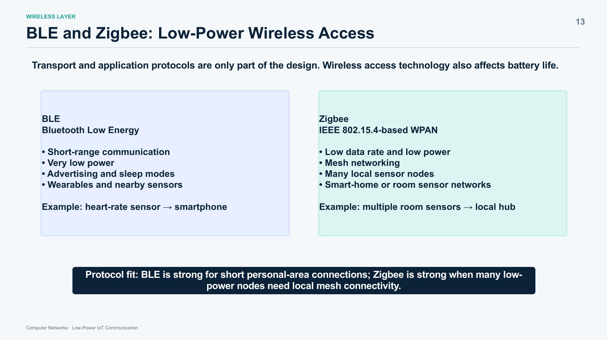
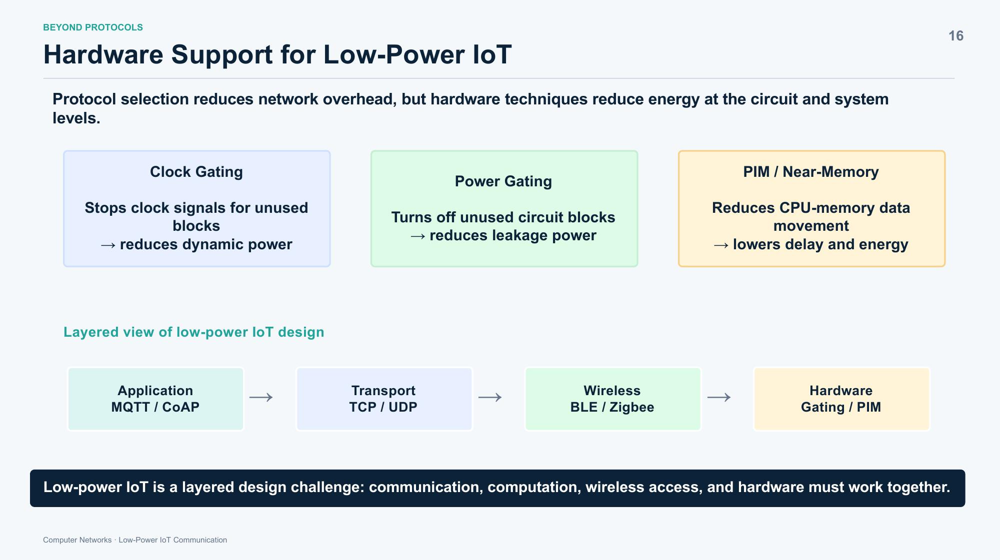
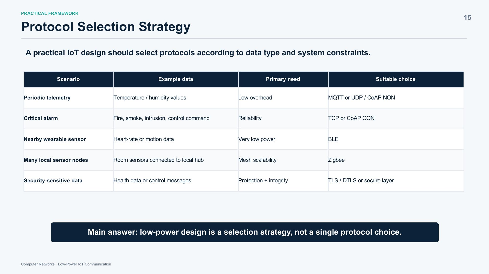
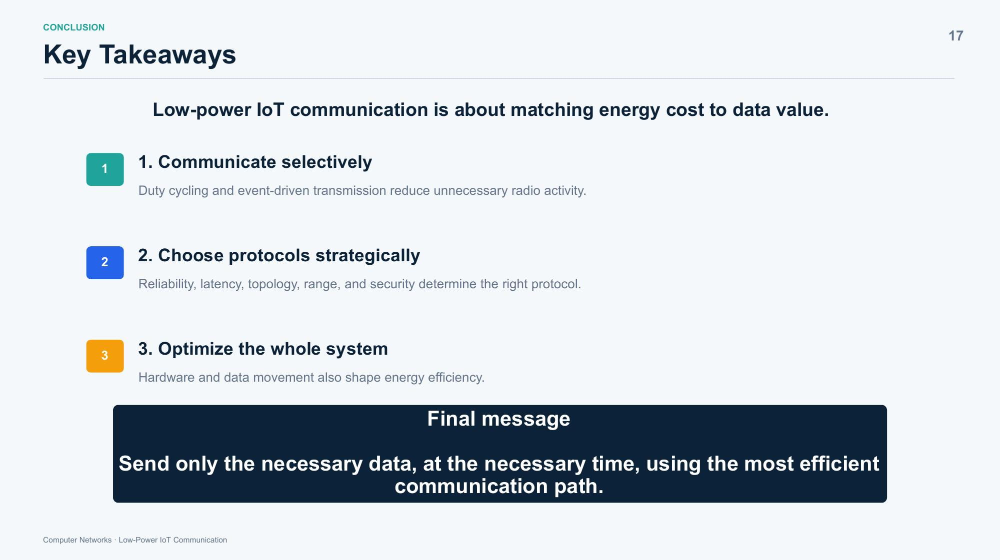

[README.md](https://github.com/user-attachments/files/28872879/README.md)
# Low-Power IoT Communication: Core Technologies & Selection Strategy

> **Computer Networks Presentation — Group 5**  
> *How IoT systems reduce energy through protocol choice, communication scheduling, and system-level design.*

---

## 📹 Presentation Video

> 🎬 **([YOUR_VIDEO_LINK_HERE](https://drive.google.com/file/d/1hZUf18d3AF41xM754aHz9wCVzMvbcIET/view?usp=drive_link))**

---

## 👥 Team Members

| # | Name | Student ID | Role | Research Focus |
|---|------|-----------|------|----------------|
| 1 | Junsu Oh | 2022270668 | Presenter / Team Coordinator | Overall Structure & Protocol Selection Strategy |
| 2 | Minju Ki | 2024270677 | Protocol Researcher / Q&A | TCP, UDP, and MQTT |
| 3 | Hyeonbin Kim | 2022271342 | IoT Protocol Researcher / Q&A | CoAP, BLE, and Zigbee |
| 4 | Gyuri Park | 2024270637 | Low-Power Design Researcher / Q&A | Duty Cycling, PIM, Clock Gating, Power Gating |

---

## 📋 Table of Contents

1. [Why Low-Power IoT Matters](#1-why-low-power-iot-matters)
2. [Where Energy Is Spent](#2-where-energy-is-spent)
3. [Low-Power Design Principles](#3-low-power-design-principles)
4. [Protocol Analysis](#4-protocol-analysis)
   - [TCP vs UDP](#41-tcp-vs-udp--reliabilityenergy-trade-off)
   - [MQTT](#42-mqtt--lightweight-publishsubscribe)
   - [CoAP](#43-coap--udp-with-selective-reliability)
   - [BLE & Zigbee](#44-ble--zigbee--low-power-wireless-access)
5. [Addressing UDP Limitations](#5-addressing-udp-limitations)
6. [Hardware Support](#6-hardware-support-for-low-power-iot)
7. [Protocol Selection Strategy](#7-protocol-selection-strategy)
8. [Key Takeaways](#8-key-takeaways)
9. [References](#9-references)

---

## 1. Why Low-Power IoT Matters

IoT devices differ fundamentally from general-purpose computers: they are small, widely distributed, and expected to operate autonomously for months or even years on a single battery charge.



### Motivating Examples

| Device | Constraint |
|--------|-----------|
| Temperature sensor (building) | Periodic sensing, low replacement frequency |
| Wearable device | Tiny battery, frequent data updates |
| Smart meter | Long-term field operation, remote location |
| Industrial sensor | Difficult or costly to maintain/replace |

These constraints converge on three compounding challenges:

- **Small batteries** — limited total energy capacity
- **Always sensing** — continuous or periodic monitoring loads
- **Mass deployment** — even tiny per-device overhead multiplies across thousands of nodes

> **Central question:** *How can an IoT system stay connected while spending as little energy as possible?*

---

## 2. Where Energy Is Spent

Low-power design starts by identifying where energy actually goes. There are three major energy sinks:


| 1. Wireless Communication | 2. CPU Computation | 3. Data Movement |
|--------------------------|-------------------|-----------------|
| Radio wake-up | Sensor processing | CPU↔memory traffic |
| Packet transmission | Control logic | Buffer copies |
| ACK / retransmission | Encryption | Protocol overhead |
| Connection maintenance | Application logic | Storage access |

### Illustrative Example

Consider a periodic temperature sensor that:
- Wakes the radio too frequently,
- Encrypts every tiny packet individually, and
- Copies data through multiple buffers on each read.

Even though each individual message is small, battery life degrades rapidly — not because the data is large, but because the *system* is inefficient.

> **Key insight:** Low-power IoT is a **system problem**, not merely a battery capacity problem.

---

## 3. Low-Power Design Principles

The goal is not to eliminate communication — it is to communicate *only when it is useful*.

```
Send less data  →  Sleep more often  →  Move less data
     ↓                   ↓                    ↓
Reduce unnecessary   Keep radio & CPU    Reduce internal
packets/overhead     inactive when idle  memory traffic
```

### 3.1 Duty Cycling

Instead of remaining active continuously, IoT systems alternate between **active** and **sleep** states.


```
Timeline:
┌────────┐  ┌──────────────────┐  ┌────────┐  ┌──────────────────┐
│ ACTIVE │  │      SLEEP       │  │ ACTIVE │  │      SLEEP       │
│  1 sec │  │      9 sec       │  │  1 sec │  │      9 sec       │
└────────┘  └──────────────────┘  └────────┘  └──────────────────┘

Duty cycle = 10%  →  Up to ~90% energy savings on radio/CPU
```

**Trade-off:** Lower duty cycle reduces energy consumption but may increase response latency or degrade monitoring resolution.

### 3.2 Event-Driven vs. Periodic Communication

| Approach | Behavior | Best For |
|----------|----------|----------|
| **Periodic** | Transmit every N seconds regardless of change | Regular telemetry (temperature, humidity) |
| **Event-driven** | Stay silent until a meaningful event occurs | Alerts, anomaly detection (fire, intrusion) |

A fire sensor, for instance, should remain silent during normal conditions and transmit only when abnormal temperature or smoke is detected — saving energy proportional to the quiet period.

### 3.3 Practical Decision Rule

> Match protocol overhead to data importance:
> - **Loss-tolerant, repeated data** (routine readings) → lightweight transmission
> - **Critical, non-repeatable data** (alarms, commands) → pay the reliability cost

---

## 4. Protocol Analysis

There is no single best protocol. The right choice depends on which layer of the stack is being designed and what the data requirements are.

### 4.1 TCP vs UDP — Reliability/Energy Trade-off

The transport layer choice has a direct and significant impact on packet overhead, delay, and total energy consumption.


| | TCP | UDP |
|---|---|---|
| **Connection** | Connection-oriented | Connectionless |
| **Reliability** | ACK + retransmission | No guarantee |
| **Header size** | ~20 bytes | ~8 bytes |
| **Latency** | Higher | Lower |
| **Overhead** | Higher | Lower |
| **Summary** | Reliable but heavier | Lightweight but no guarantees |

**Decision logic:**

```
Is packet loss acceptable?
        │
        ├── NO  (fire alarm, control command)  →  TCP
        │
        └── YES (routine sensor stream)        →  UDP
```

> **For low-power IoT, the key question is not "TCP or UDP?" but "which data requires which level of reliability?"**

### 4.2 MQTT — Lightweight Publish/Subscribe

MQTT decouples data producers and consumers through a **broker**, making it well-suited for cloud-connected IoT telemetry.


```
 Sensor / Publisher          MQTT Broker           Subscriber
 ┌─────────────────┐    ┌─────────────────┐    ┌─────────────────┐
 │                 │    │                 │    │                 │
 │  Temp = 23°C    │───▶│  Topic routing  │───▶│  App / Cloud    │
 │                 │    │                 │    │  Dashboard      │
 └─────────────────┘    └─────────────────┘    └─────────────────┘
                         Topic example:
                    home/livingroom/temperature
```

**QoS levels control the reliability–overhead trade-off:**

| QoS Level | Guarantee | Overhead | Use Case |
|-----------|-----------|----------|----------|
| **QoS 0** | At most once | Lowest | Non-critical telemetry |
| **QoS 1** | At least once (possible duplicate) | Medium | General sensor data |
| **QoS 2** | Exactly once | Highest | Financial, control commands |

**Best fit:** Cloud-connected sensor reporting and repeated telemetry streams.

### 4.3 CoAP — UDP with Selective Reliability

CoAP retains UDP's lightweight nature but adds *optional* reliability at the application layer — arguably the most elegant IoT-specific design choice covered in this presentation.


```
 Routine sensor reading               NON message (no ACK)
 ┌────────────────────┐               ┌─────────────────────┐
 │ Temperature: 23°C  │──────────────▶│ Low overhead        │
 └────────────────────┘               └─────────────────────┘

 Critical alarm / command             CON message (ACK required)
 ┌────────────────────┐               ┌─────────────────────┐
 │ Smoke detected!    │──────────────▶│ Reliability assured │
 └────────────────────┘               └─────────────────────┘
```

**Key principle:** Do not pay the reliability cost for every packet. Apply it only when the data demands it.

This per-message granularity is what makes CoAP particularly powerful for constrained IoT environments.

### 4.4 BLE & Zigbee — Low-Power Wireless Access

Transport and application protocols only address part of the energy problem. The wireless access technology itself also determines battery life.


| Feature | BLE (Bluetooth Low Energy) | Zigbee (IEEE 802.15.4 WPAN) |
|---------|---------------------------|----------------------------|
| **Range** | Short-range | Short-range (mesh extends coverage) |
| **Power** | Extremely low | Low |
| **Topology** | Point-to-point, star | Mesh network |
| **Node scale** | Personal-area (few devices) | Many local sensor nodes |
| **Use case** | Wearables, nearby sensors | Smart-home, room sensor networks |
| **Example** | Heart-rate sensor → smartphone | Room sensors → local hub |

**Protocol fit summary:**
- **BLE** — optimal for short personal-area connections (wearables, nearby devices)
- **Zigbee** — optimal when many low-power nodes require local mesh connectivity (smart home, industrial floor)

---

## 5. Addressing UDP Limitations

UDP is attractive for low-power IoT due to its minimal overhead, but raw UDP is insufficient for production systems. Practical IoT designs add targeted mechanisms around it:

| UDP Limitation | Why It Matters | Practical Approach |
|----------------|---------------|-------------------|
| **Reliability** | No delivery or ordering guarantee | CoAP CON/NON — add ACK only when needed [1] |
| **Efficiency** | Small data units can disproportionately suffer from per-packet overhead | Intelligent TCP↔UDP switching or multi-channel UDP [1][2] |
| **Security** | UDP has no built-in security mechanism | DTLS or alternative secure UDP layer [5] |

**Logical deduction:** UDP itself is a minimal primitive. The IoT design challenge is deciding *which* reliability, throughput, or security properties to layer on top, and *only for the data that requires them*. This selective layering is what keeps energy consumption low while maintaining acceptable guarantees.

---

## 6. Hardware Support for Low-Power IoT

Protocol-level optimizations reduce network overhead, but hardware-level techniques address energy consumption at the circuit and system level — the final layer of defense.


| Layer | Technology | Role |
|-------|-----------|------|
| **Application** | MQTT / CoAP | Message format & delivery semantics |
| **Transport** | TCP / UDP | Reliability & connection management |
| **Wireless** | BLE / Zigbee | Low-power radio access |
| **Hardware** | Clock Gating / Power Gating / PIM | Circuit-level energy reduction |

### Hardware Techniques

**Clock Gating**
- Stops clock signals to unused circuit blocks
- Reduces **dynamic power** (power consumed during switching activity)
- Machine learning-based methods are now being explored to predict optimal gating decisions [6]

**Power Gating**
- Completely shuts off power to unused circuit blocks
- Reduces **leakage power** (static current that flows even when a circuit is idle)
- Particularly valuable during deep sleep intervals between duty cycles

**PIM / Near-Memory Computing**
- Moves computation closer to where data is stored, eliminating repeated CPU↔memory round trips
- Reduces both processing **delay** and **energy** for data-intensive sensor preprocessing
- Especially relevant when many small sensor values are repeatedly buffered and processed

---

## 7. Protocol Selection Strategy

Low-power design is a **selection strategy**, not a single protocol choice. The practical framework below maps use cases to appropriate protocol combinations.


| Scenario | Example Data | Primary Need | Suitable Choice |
|----------|-------------|-------------|----------------|
| Periodic telemetry | Temperature / humidity | Low overhead | MQTT or UDP / CoAP NON |
| Critical alarm | Fire, smoke, intrusion, control command | Reliability | TCP or CoAP CON |
| Nearby wearable sensor | Heart-rate, motion data | Very low power | BLE |
| Many local sensor nodes | Room sensors → local hub | Mesh scalability | Zigbee |
| Security-sensitive data | Health data, control messages | Protection + integrity | TLS / DTLS |

### Decision Flowchart

```
Start: New IoT data type
         │
         ▼
Is packet loss acceptable?
    │           │
   YES          NO
    │           │
    ▼           ▼
Is it          Use TCP
time-critical? or CoAP CON
    │
    ├── YES → CoAP NON (low latency, low overhead)
    │
    └── NO  → Is it cloud telemetry?
                   │
                   ├── YES → MQTT (QoS 0 or 1)
                   │
                   └── NO  → Is range short (<10m)?
                                   │
                                   ├── YES → BLE
                                   │
                                   └── NO  → Zigbee (mesh)
```

---

## 8. Key Takeaways

Low-power IoT communication is fundamentally about **matching energy cost to data value**.


1. **Communicate selectively** — Duty cycling and event-driven transmission eliminate unnecessary radio activity. The less the radio is awake, the longer the battery lasts.

2. **Choose protocols strategically** — No single protocol dominates all scenarios. Reliability, latency, topology, range, and security requirements collectively determine the correct choice.

3. **Optimize the whole system** — Hardware techniques (clock gating, power gating, PIM) and internal data movement patterns shape energy efficiency just as much as protocol selection does.

> **Final message:** *Send only the necessary data, at the necessary time, using the most efficient communication path.*

---

## 9. References

| # | Paper / Source |
|---|---------------|
| [1] | Intelligent TCP↔UDP Switching (2022) |
| [2] | OPC UA Pub/Sub UDP Multi-Channel & Image Transmission (2021) |
| [3] | Comparative Analysis: CoAP vs MQTT vs XMPP (2018) |
| [4] | Permutation-Based TCP & UDP Transmissions (2021) |
| [5] | Graphene: Secure TCP/UDP Cloud Architecture (2020) |
| [6] | Machine Learning based Methods for Clock Gating and Design Quality Prediction (클록 게이팅과 설계 품질 예측을 위한 머신러닝 기법 연구) |

---

<p align="center">
  <sub>Computer Networks · Low-Power IoT Communication · Team Project</sub>
</p>
